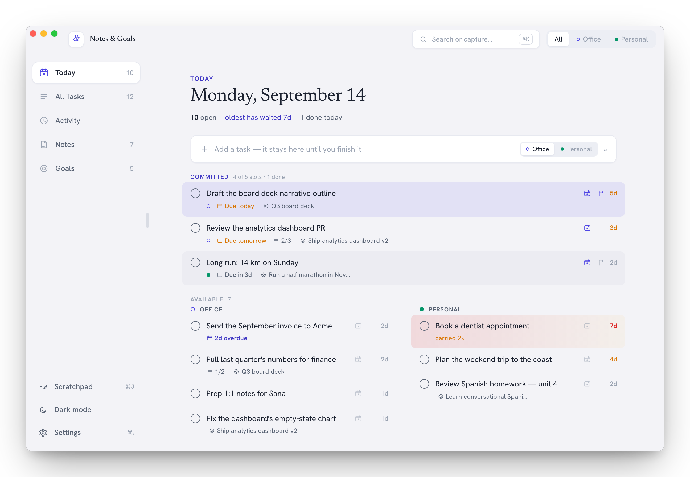
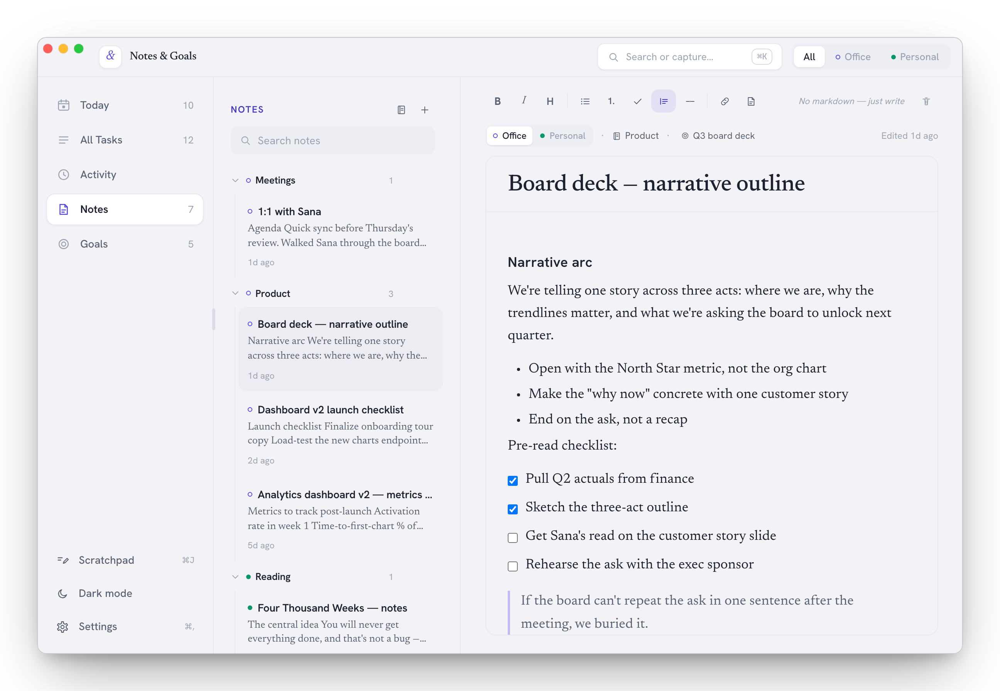
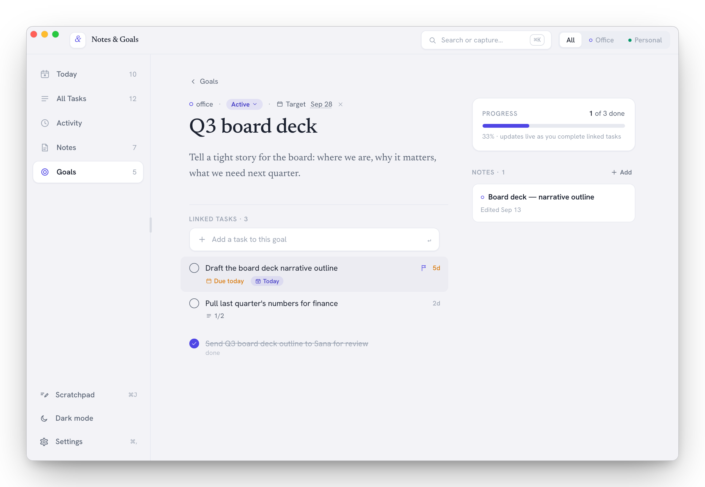
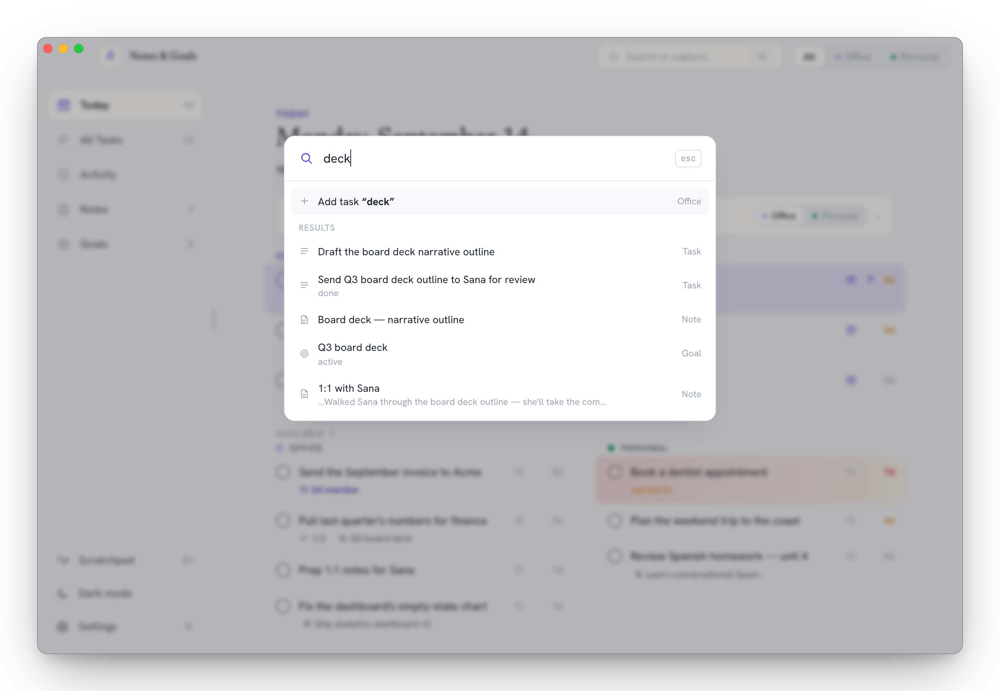
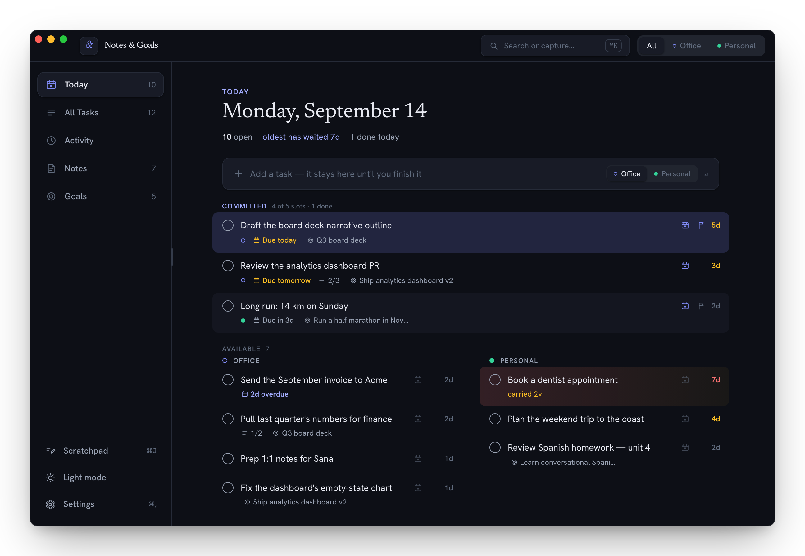

# Notes & Goals

[](https://github.com/Ashishjain608/notes-goals-app/actions/workflows/ci.yml)
[](LICENSE)
[](https://github.com/Ashishjain608/notes-goals-app/releases/latest)

A calm, local-first macOS app that unifies your daily **tasks**, **notes**, and longer-term **goals** — all stored as plain, inspectable files in a folder you choose. No database server, no cloud, no accounts, no telemetry. Things/Bear in spirit, never Notion/ClickUp.

**[Download for macOS](https://github.com/Ashishjain608/notes-goals-app/releases/latest)** · [Website](https://ashishjain608.github.io/notes-goals-app/) · [Install guide](#install) · [Contributing](CONTRIBUTING.md)

<picture>
  <source media="(prefers-color-scheme: dark)" srcset="site/screenshots/today-dark.png">
  
</picture>

## The idea

The **task is the source of truth**, not a daily page. **Today** is a live query over all your tasks: an open task keeps appearing there until you mark it _done_ or _dropped_. Carry-forward is automatic and invisible — there's no copy-paste, no migration, ever. Tasks and notes connect to goals, and a goal's progress is computed live from its linked tasks.

## Screenshots

<table>
  <tr>
    <td width="50%" valign="top">
      <picture><source media="(prefers-color-scheme: dark)" srcset="site/screenshots/notes-dark.png"></picture>
      <p align="center"><b>Notes</b> — a WYSIWYG editor that saves portable Markdown</p>
    </td>
    <td width="50%" valign="top">
      <picture><source media="(prefers-color-scheme: dark)" srcset="site/screenshots/goal-dark.png"></picture>
      <p align="center"><b>Goals</b> — progress computed from linked tasks</p>
    </td>
  </tr>
  <tr>
    <td width="50%" valign="top">
      <picture><source media="(prefers-color-scheme: dark)" srcset="site/screenshots/search-dark.png"></picture>
      <p align="center"><b>Search (⌘K)</b> — tasks, goals, notebooks, and note bodies</p>
    </td>
    <td width="50%" valign="top">
      <picture><source media="(prefers-color-scheme: dark)" srcset="site/screenshots/today-light.png"></picture>
      <p align="center"><b>Light and dark</b> themes</p>
    </td>
  </tr>
</table>

## Install

Requires macOS 12 (Monterey) or later, on Apple Silicon or Intel.

1. Download the `.dmg` from the [latest release](https://github.com/Ashishjain608/notes-goals-app/releases/latest), open it, and drag **Notes & Goals** into **Applications**.
2. Double-click the app. Builds aren't notarized by Apple yet, so macOS stops the first launch and says it can't verify the app — click **Done** (not *Move to Trash*).
3. Open **System Settings → Privacy & Security**, scroll down to **Security**, click **Open Anyway**, and confirm with your login password. The button shows up for about an hour after step 2.
4. The app opens and walks you through choosing a data folder. From then on it opens like any other app.

Prefer Terminal? This replaces steps 2 and 3:

```bash
xattr -dr com.apple.quarantine "/Applications/Notes & Goals.app"
```

A new version may ask for approval again. Installing, updating, or deleting the app never touches your data folder, and you can switch folders later from **Settings (⌘,)**.

Notarizing needs a paid Apple Developer account, which this project doesn't have yet. Release builds are ad-hoc signed and built from the tagged source by the [Release workflow](.github/workflows/release.yml) — or [build it yourself](#build-from-source).

## Your data

Everything lives in the data folder you pick on first launch:

```
<data folder>/tasks/<uuid>.json      one file per task
<data folder>/notes/<uuid>.md        YAML frontmatter + markdown body
<data folder>/goals/<uuid>.json      one file per goal
<data folder>/notebooks/<uuid>.json  one file per notebook (groups notes; ADR-0008)
<data folder>/.atlas/trash/          deleted files (never hard-unlinked)
```

Plain files mean it's portable and git/Dropbox/iCloud-friendly — point the folder wherever you like; that's your call, not the app's.

## Highlights

- **Today** — a live view of open, un-snoozed tasks; carry-forward is automatic, there's no daily page.
- **The day's slate** — commit up to five tasks (office and personal mixed) to today; finish them all and the day is done. No points, no streaks, no penalties — just a finish line.
- **Global search** — ⌘K searches tasks, goals, notebooks and notes, note *bodies* included, and jumps straight to the result.
- **Tasks** — priority flags, due dates, snooze, single-level subtasks, and a slide-in detail panel.
- **Notes** — a WYSIWYG editor (headings, lists, checkboxes, quotes, a divider, links that open in your browser on ⌘-click, and smart `--`→— / `...`→…), organized into **context-scoped notebooks** with drag-and-drop filing.
- **Goals** — progress computed live from linked tasks, plus notes you can **add and edit in place** (they also appear in Notes).
- **Activity** — a read-only look back at the tasks you created and completed on any chosen day.
- **Scratchpad** — a floating, draggable brain-dump pad (⌘J) that lives only on your device, never in the data folder.
- An **Office / Personal** context filter across every view, light + dark themes, and a ⌘K command palette.

## Build from source

You need **Rust** (stable, via [rustup](https://rustup.rs)), **Node.js 18+**, and the **Xcode Command Line Tools** (`xcode-select --install`).

```bash
git clone https://github.com/Ashishjain608/notes-goals-app.git
cd notes-goals-app
npm install
npm run tauri:dev     # launch in dev mode (the first Rust build takes a few minutes)
npm run tauri:build   # .app and .dmg land in src-tauri/target/release/bundle/
```

Tests, conventions, and the project layout are in [`CONTRIBUTING.md`](CONTRIBUTING.md).

## Tech stack

- **[Tauri 2](https://tauri.app)** → a real native macOS `.app`
- **React + TypeScript + Tailwind** frontend (design tokens live in a reusable preset under `design/`)
- **Rust** owns all filesystem I/O (atomic writes); the frontend holds the working store
- **TipTap** WYSIWYG notes editor, serialized to portable Markdown
- **Zustand** for state

## Documentation

- [`CONTEXT.md`](CONTEXT.md) — domain glossary
- [`docs/IMPLEMENTATION_PLAN.md`](docs/IMPLEMENTATION_PLAN.md) — the full build plan
- [`docs/adr/`](docs/adr/) — architectural decision records
- [`docs/agents/BUILD_CONTRACT.md`](docs/agents/BUILD_CONTRACT.md) — frozen module interfaces
- [`CHANGELOG.md`](CHANGELOG.md) — what changed in each release

## Contributing

Bug reports, ideas, and pull requests are welcome. `main` is protected, so every change — the maintainer's included — lands through a pull request with passing CI. Start with [`CONTRIBUTING.md`](CONTRIBUTING.md), and report security issues privately as described in [`SECURITY.md`](SECURITY.md).

## License

[MIT](LICENSE) © 2026 Ashish Jain
